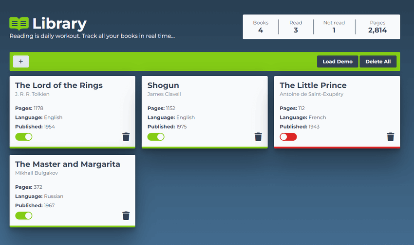

### Project: [Library](https://gdimitroff.github.io/library/)

Small virtual library app, created with **HTML**, **CSS** and **JavaScript**. The data is stored in **localStorage**. The project is from The Odin Project [curriculum](https://www.theodinproject.com/lessons/node-path-javascript-library).

### Features

- Data is **saved** in `localStorage`
- You can **add a book**
- You can **delete a particular book**
- You can **delete all books at once**
- Before adding a book, you can **mark if it's already read or not**
- Dynamic **stats update** when adding/removing/changing read status
- Added multiple **animations** to make everything look smooth
- **Fully responsive**
- Added **validations** before submitting new book

### Outcome

- Used **HTML5 semantic elements** for better structure and readability
- Used **CSS Grid** to make books grid fully responsive
- Used **CSS Flexbox** module to create layout
- Adapted **fancy style** for input placeholders
- Learned how to **create a custom checkbox**
- Learned how to **create a modal**
- Learned how to **save and get data** from `localStorage`
- Deepened knowledge of **DOM manipulation**, **HTML structure**, **CSS styling subtleties** and **JS functionality** in general

